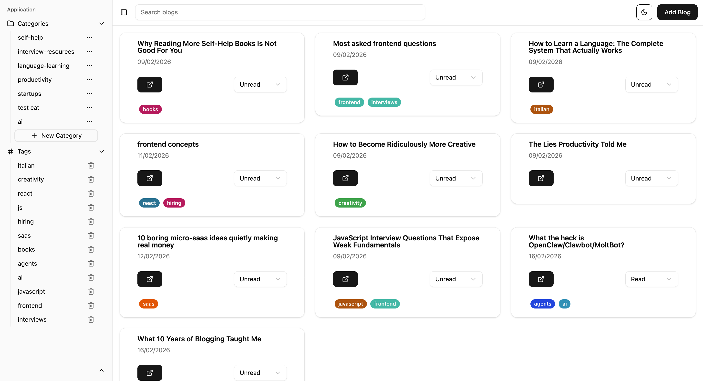

# BlogZone 🚀

**BlogZone** is a modern, full-stack web application designed to help developers and avid readers manage their reading lists. It allows users to organize blogs into categories, tag them for easy filtering, track read status, and leverage AI to generate instant summaries of articles.



## ✨ Key Features

- **🔐 Secure Authentication**: Google Sign-In integration for seamless access.
- **📊 Interactive Dashboard**: Centralized view of all your blogs with search and filtering capabilities.
- **🤖 AI-Powered Summaries**: Instantly generate summaries for long articles using AI integration.
- **🏷️ Organization**:
  - **Categories**: Group blogs into custom categories (e.g., React, DevOps, Lifestyle).
  - **Tags**: Add color-coded tags to entries for granular filtering.
- **✅ Progress Tracking**: Mark articles as "Read" or "Unread" to keep track of your reading list.
- **🎨 Modern UI**: Fully responsive design with Dark/Light mode support, built with Shadcn UI and Tailwind CSS v4.

## 🛠️ Tech Stack

### Frontend
- **Framework**: React 19 + Vite
- **Language**: TypeScript
- **Styling**: Tailwind CSS v4, Tailwindcss-animate
- **UI Components**: Shadcn UI (Radix UI primitives), Lucide React
- **State Management**: TanStack Query (React Query) v5, Context API
- **Routing**: React Router DOM v7
- **Forms**: React Hook Form + Zod

### Backend & DevOps
- **Containerization**: Docker
- **CI/CD**: GitHub Actions
- **Hosting**: Hetzner VPS
- **Orchestration**: Docker Compose
- **Reverse Proxy**: Nginx

## 🚀 Getting Started

### Prerequisites
- Node.js (v18+)
- Docker (optional, for containerized runs)
- A Google Cloud Project (for OAuth Client ID)

### Installation

1. **Clone the repository**
   ```bash
   git clone https://github.com/yourusername/blogzone.git
   cd blogzone
   ```

2. **Frontend Setup**
   ```bash
   cd frontend
   npm install
   ```

3. **Environment Variables**
   Create a `.env` file in the `frontend` directory:
   ```env
   VITE_BASE_URL=http://localhost:8080/api
   VITE_GOOGLE_CLIENT_ID=your-google-client-id-here
   ```

4. **Run Development Server**
   ```bash
   npm run dev
   ```
   The app will be available at `http://localhost:5173`.

## 📂 Project Structure

```text
frontend/src/
├── components/         # Shared UI components (ui/, dashboard/, LandingPage/)
├── context/            # Global contexts (AuthContext, SearchContext)
├── features/           # Feature-based modules
│   ├── blogs/          # Blog listing, cards, creation, sheets
│   ├── categories/     # Sidebar category management
│   └── tags/           # Sidebar tag management
├── hooks/              # Custom hooks (React Query wrappers)
├── lib/                # Utilities (utils, queryKeys)
├── pages/              # Route views (LandingPage, Dashboard)
└── types/              # TypeScript interfaces
```

## 🚢 Deployment

The project uses **GitHub Actions** for Continuous Deployment.

### Workflow (`deploy.yml`)
1. **Trigger**: Pushes to the `master` branch.
2. **Build**:
   - Builds Docker images for Frontend and Backend.
   - Pushes images to Docker Hub.
3. **Deploy**:
   - SSHs into the Hetzner VPS.
   - Pulls the latest images.
   - Restarts containers using Docker Compose.
   - Reloads Nginx to serve the updated SPA.

## 🤝 Contributing

1. Fork the repository.
2. Create a new branch (`git checkout -b feature/AmazingFeature`).
3. Commit your changes (`git commit -m 'Add some AmazingFeature'`).
4. Push to the branch (`git push origin feature/AmazingFeature`).
5. Open a Pull Request.

## 📄 License

Distributed under the MIT License. See `LICENSE` for more information.

---

Built with ❤️ by Partik Singh
